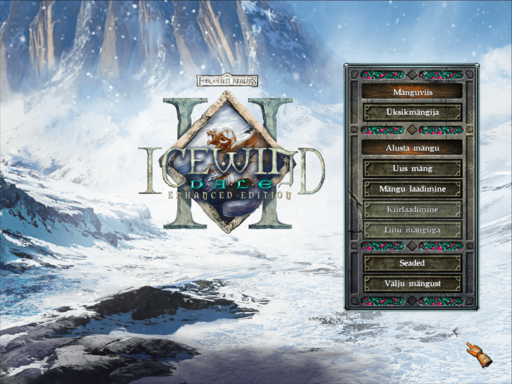
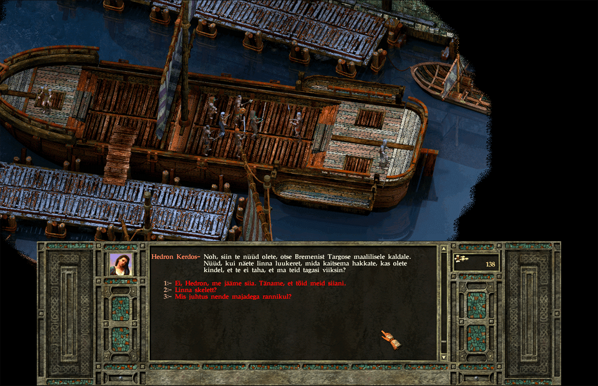
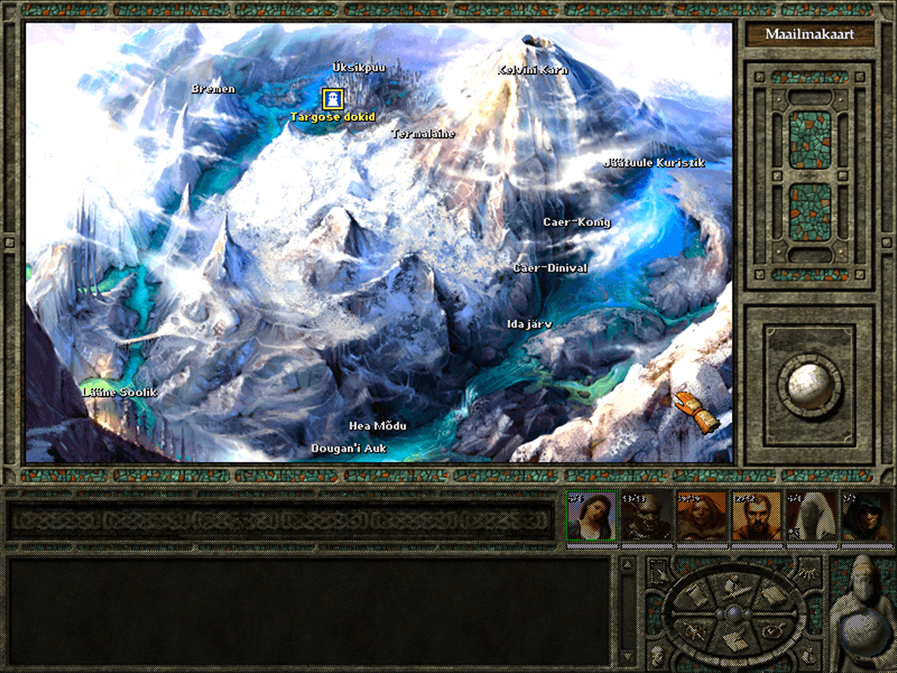
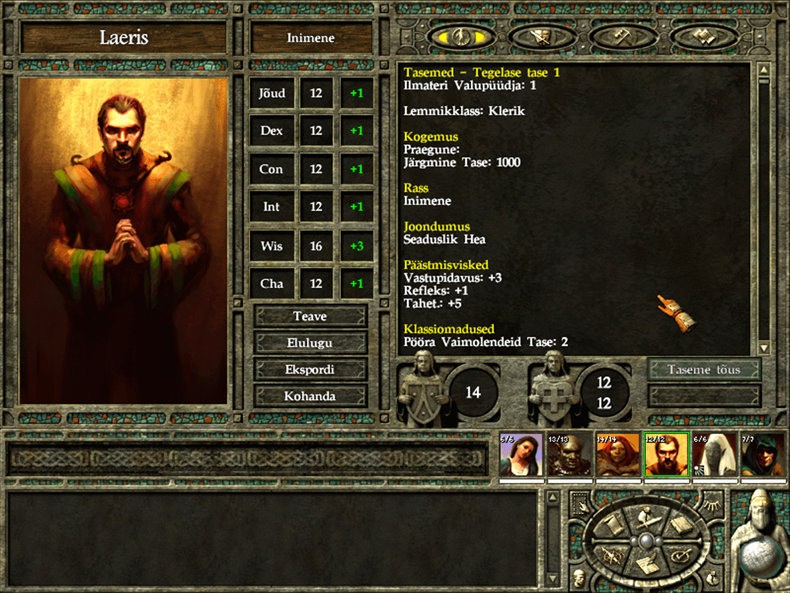
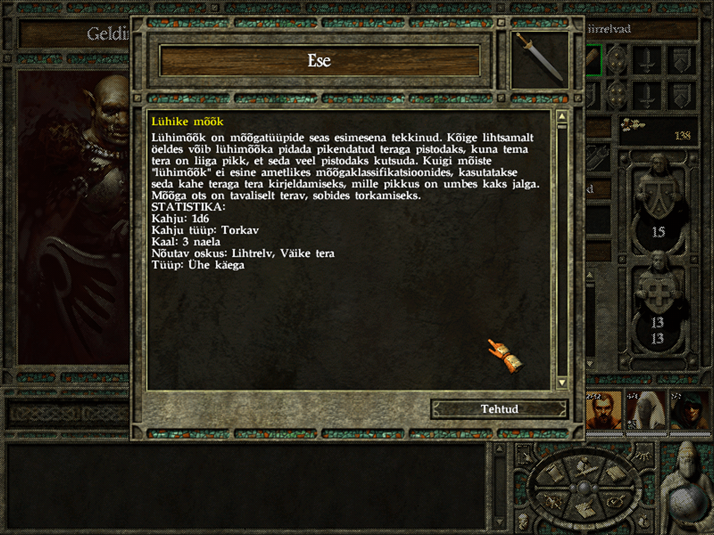

# IWD2C-et 🇪🇪

### Project intro 🇬🇧

Icewind Dale II is a role-playing video game developed by Black Isle Studios and published by Interplay Entertainment. It was released in 2002.

IWD2C-et is an exploratory experiment to achieve total translation of the game to Estonain, using the help of AI and tooling from [IWD2EE-tra](https://github.com/exsilium/IWD2EE-tra) project.

The base translation is based on Icewind Dale 2 Complete edition version available for purchase from [GoG](https://www.gog.com/en/game/icewind_dale_2).

### Projekti tutvustus

Icewind Dale II (Jäätuule Org 2) on aastal 2002 loodud arvutimäng, mis kasutab D&D 3E süsteemi.

[IWD2EE-tra](https://github.com/exsilium/IWD2EE-tra) ja IWD2C-et on katsetuslikud projektid, mille eesmärk on võimaldada mängusisu haldust ja tõlget kasutades selleks väliseid tööriistu. Läbi nende kahe projekti on võimalik Icewind Dale 2'te mängida eesti keeles.

Esialgne tõlge on saavutatud kasutades tehisaru suuri keelemudeleid. See seab piirid tõlke kvaliteedile, mis puudutab fantaasiarohket ilukirjanduslikku teksti. Parema tõlkekvaliteedi saavutamiseks on vaja inimkätt, et ühtlustada ja toonida tekst mängule sobivaks.

### Miks?

- Nostalgia;
- Soov luua DnD eesti keelset sisu nooremale põlvkonnale, haakub [DnD-et](https://github.com/exsilium/DnD-et) projekti eesmärgiga;
- Tehniline katsetus LLM ja OpenAI Batch API vastu, kasutades selleks juba olemasolevat andmekogu;
- Päringute koostamise katsetus (Prompt Engineering)

### Miks IWD2?

- [WeiDU](https://weidu.org) tööriistade saadavus Infinity Engine mängudele;
- IWD2 on viimane ja kõige modernsem Infinity Engine mootoril põhinev D&D arvutimäng;
- Erinevalt teistest Infinity Engine mängudest, põhineb IWD2 D&D 3E reeglisüsteemil;
- Tekstiliselt on mängu sisu väiksem ja lihtsam kui BG1/2,PS:T; 
- Kogukonna loodud "Täiustatud Väljaanne" - [IWD2EE](https://github.com/RedChimera/IWD2EE) tõi palju parandusi mängu;